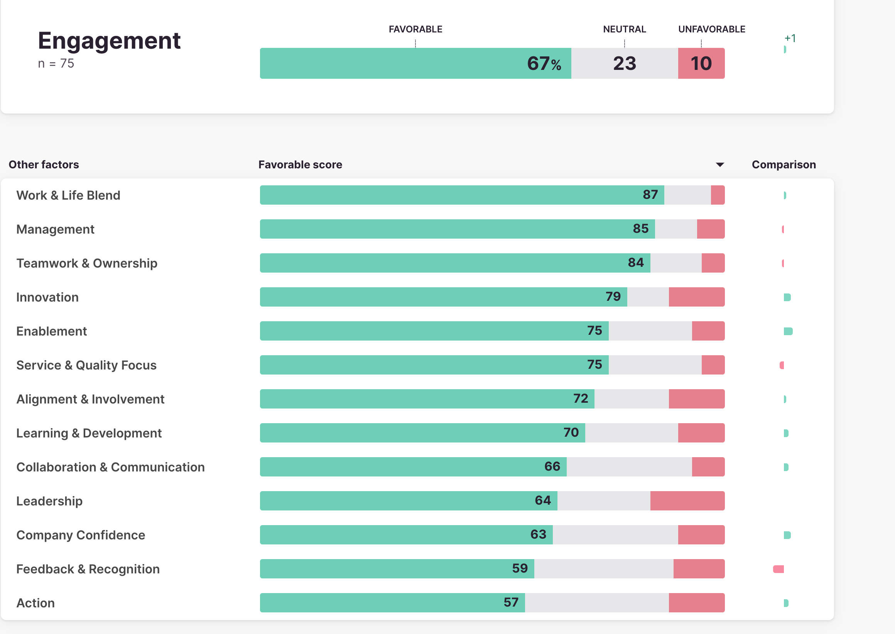

# First Steps

This is how an image in the body renders

To convert screen recordings into animated GIF's use [Adobe's converter](https://www.adobe.com/express/feature/video/convert/video-to-gif)

To record a screen click CTRL-Shift 5 and select the video option
